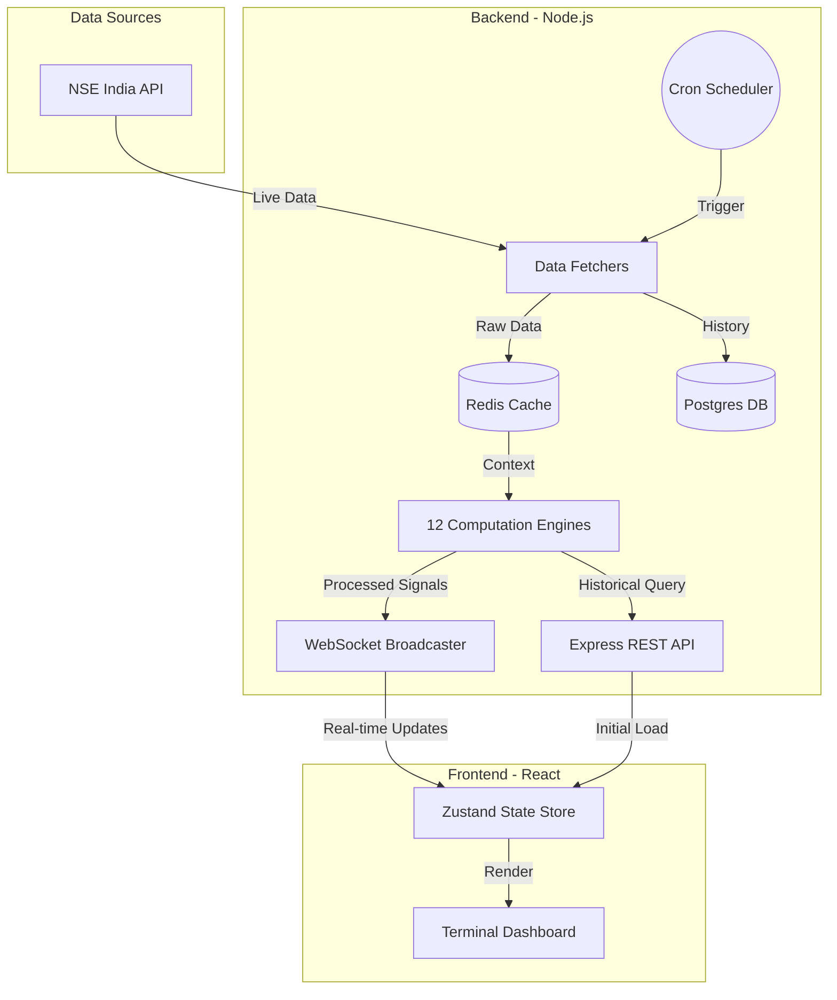

# Institutional Options Intelligence Platform 📈

A high-performance, real-time options market intelligence platform designed for quantitative analysis of the National Stock Exchange of India (NSE). This system aggregates live market data, computes advanced derivatives metrics using 12 specialized mathematical engines, and broadcasts actionable intelligence to a sleek, terminal-inspired frontend via WebSockets.

## 🌟 Key Features

- **Real-Time Data Aggregation:** Automated background fetching of Option Chains, FII/DII Data, India VIX, Sector Indices, and Market Breadth.
- **12 Quantitative Engines:** Comprehensive analysis pipeline including Black-Scholes Greeks, Put-Call Ratio (PCR), Max Pain, Supply/Demand Zones, Sector Rotation, Institutional Flow, Technicals, and a Master Scoring Engine.
- **Terminal Aesthetic UI:** A clean, monochromatic React dashboard with dynamic UI panels, signal badges, and deterministic formula breakdowns.
- **Low-Latency Broadcasting:** Built on WebSockets and Redis caching to ensure the frontend reflects market shifts instantly.
- **Containerized Architecture:** Fully dockerized stack (Node.js backend, React frontend, PostgreSQL, Redis) for seamless deployment.

---

## 🏗 System Architecture

The platform follows a decoupled architecture, isolating data ingestion, computation, and presentation layers.



---

## ⚙️ Computation Pipeline

At the core of the backend is the engine pipeline. Every time new market data is fetched, the payload passes through 12 sequential mathematical engines. Each engine enriches the data payload, culminating in a `Master Scoring` result.

```mermaid
flowchart LR
    Start([Raw NSE Data]) --> E1(Option Chain & Greeks)
    E1 --> E2(Supply & Demand)
    E2 --> E3(Put-Call Ratio)
    E3 --> E4(Max Pain)
    E4 --> E5(Volatility & VIX)
    E5 --> E6(Market Breadth)
    E6 --> E7(Sector Rotation)
    E7 --> E8(Institutional Flow)
    E8 --> E9(Technical Indicators)
    E9 --> E10(Futures Engine)
    E10 --> E11(Master Scoring)
    E11 --> E12(Market Regime)
    E12 --> End([Final Broadcast Payload])

    style E11 fill:#f9f,stroke:#333,stroke-width:2px
    style E12 fill:#bbf,stroke:#333,stroke-width:2px
```



---

## 🚀 Getting Started

### Prerequisites
- Docker and Docker Compose installed on your system.

### 1. Clone the Repository
```bash
git clone https://github.com/Harsh-Codes-77/Option_Intelligence.git
cd Option_Intelligence
```

### 2. Start the Platform
The entire stack (Frontend, Backend API, Redis, and Postgres) can be spun up using Docker Compose.

```bash
docker compose up --build -d
```

### 3. Access the Services
- **Frontend Dashboard:** http://localhost:3000
- **Backend REST API:** http://localhost:3001
- **Database:** Postgres running on port `5432`
- **Cache:** Redis running on port `6379`

To view live logs:
```bash
docker compose logs -f
```

---

## 📂 Project Structure

```text
├── backend/                  # Node.js Express API & Engine logic
│   ├── src/
│   │   ├── engines/          # 12 computational algorithms
│   │   ├── fetchers/         # NSE data scraping and API clients
│   │   ├── routes/           # REST API endpoints
│   │   ├── scheduler/        # Cron jobs for automated fetching
│   │   └── websocket/        # Real-time data broadcasting
│   ├── init.sql              # Database schema initialization
│   └── Dockerfile            # Backend container definition
│
├── frontend/                 # React + Vite UI
│   ├── src/
│   │   ├── components/       # UI components (Panels, Header, Modals)
│   │   ├── hooks/            # Custom React Hooks (useWebSocket)
│   │   ├── store/            # Zustand global state management
│   │   └── App.tsx           # Main application view
│   ├── nginx.conf            # Nginx config for static serving
│   └── Dockerfile            # Frontend container definition
│
├── docker-compose.yml        # Multi-container orchestration
└── README.md                 # Project documentation
```

---

## 🛠 Technology Stack

| Domain | Technology |
|---|---|
| **Frontend** | React 18, Vite, TypeScript, Tailwind CSS, Zustand, GSAP |
| **Backend** | Node.js, Express, TypeScript, `stock-nse-india` |
| **Persistence** | PostgreSQL |
| **Caching/PubSub** | Redis |
| **Containerization** | Docker, Docker Compose |
| **Maths/Finance** | Custom Black-Scholes Implementation, Standard Deviation algorithms |

## 📝 License
This project is for educational and quantitative research purposes.

Minor Update
